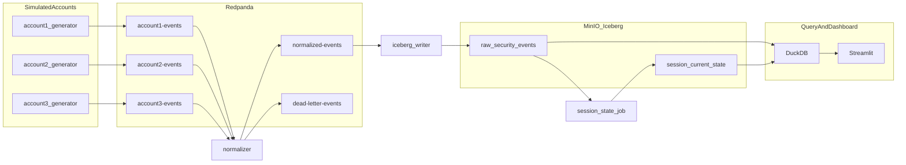

# Converge

Open-source cross-account **security lakehouse** that simulates federated writes from multiple "accounts" with heterogeneous event schemas, normalizes them into a canonical format, stores them in an immutable append-only Iceberg log with a separate derived state table, and surfaces CISO-style metrics in a Streamlit dashboard.

Built as a portfolio project to demonstrate distributed systems design: translation layers, event streaming, lakehouse storage patterns, and query/dashboard layers — runnable locally via Docker Compose.

## Architecture



## Design decisions

1. **Immutable log + derived state** — `raw_security_events` is append-only and never mutated. `session_current_state` is rebuilt from the log on a schedule. This avoids the contradiction of a tamper-evident log that gets updated in place.

2. **Translation layer** — Each source account has a pure normalizer function mapping heterogeneous JSON to a canonical `SecurityEvent` schema. Malformed records go to a dead-letter topic instead of crashing the pipeline.

3. **Small scope, clear signal** — Event volume is intentionally modest. The portfolio value is in schema design, fault tolerance, and lakehouse patterns — not raw scale.

## Quick start

### Prerequisites

- Docker & Docker Compose
- Python 3.11+ (for local dev/tests)

### Run the full pipeline

```bash
cp .env.example .env
make up
# Dashboard: http://localhost:8501
# Redpanda Console: http://localhost:8080
# MinIO Console: http://localhost:9001 (minioadmin/minioadmin)
```

### Sprint 1 mode (stdout-only generators, no Kafka)

```bash
make run-generators-stdout
```

### Run tests

```bash
make install
make test
```

## Project layout

```
src/converge/
├── generators/     # 3 heterogeneous fake event sources
├── normalizers/    # Pure functions: raw -> canonical schema
├── pipeline/       # Normalizer service, Iceberg writer, state job
├── storage/        # PyIceberg + MinIO catalog/tables
├── queries/        # DuckDB metrics
└── dashboard/      # Streamlit CISO dashboard
```

## Canonical event schema

| Field | Description |
|-------|-------------|
| `event_id` | UUID |
| `source_account` | `account1`, `account2`, `account3` |
| `event_type` | `login`, `api_call`, `network`, `unknown` |
| `occurred_at` | UTC timestamp |
| `actor` | User or IP |
| `target` | Resource, API, or destination |
| `outcome` | `success`, `failure`, `unknown` |
| `severity` | `low`, `medium`, `high` |
| `session_id` | Derived key for state aggregation |
| `flags` | e.g. `failed_login`, `suspicious_ip` |
| `raw_payload` | Original record for audit |

## Failure demo

Simulate a source outage mid-run:

```bash
docker compose stop generator-account2
# Dashboard shows account2 gap; raw log unaffected
docker compose start generator-account2
```

## AWS cloud mapping

| Local (open-source) | AWS equivalent |
|---------------------|----------------|
| Redpanda | Kinesis / Firehose |
| MinIO | S3 |
| PyIceberg + Glue-style catalog | Glue + S3 + Iceberg |
| DuckDB | Athena |
| Streamlit | QuickSight |

## Development sprints

| Sprint | Focus | Checkpoint |
|--------|-------|------------|
| 1 | Generators + compose skeleton | 3 distinct JSON streams |
| 2 | Redpanda ingestion | 3 live Kafka topics |
| 3 | Normalizers + DLQ | Unified schema + pytest |
| 4 | Iceberg + MinIO | Raw log + derived state |
| 5 | Dashboard + polish | End-to-end demo |

## License

MIT — see [LICENSE](LICENSE).
